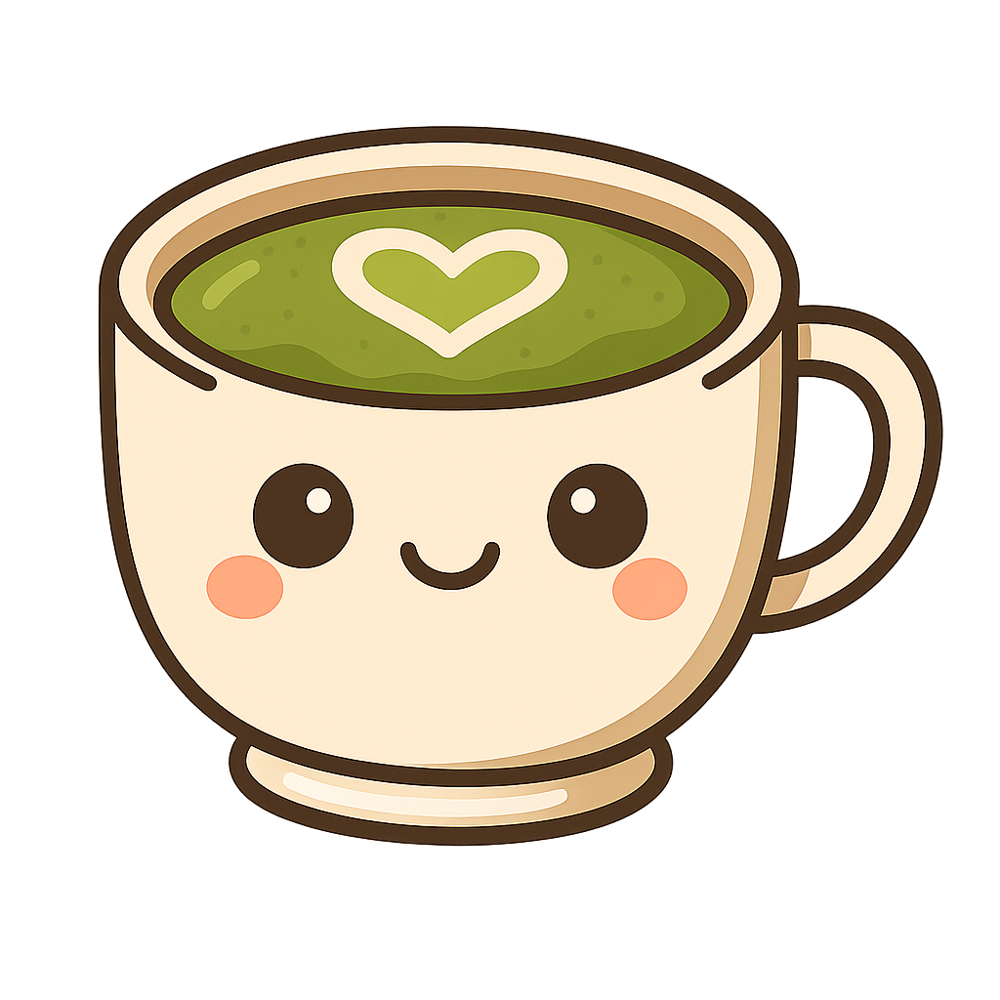

# MATCHA: Making Assistive Tools for Chart Accessibility

 
  

MATCHA (Making Assistive Tools for Chart Accessibility) is a research-backed toolset designed to evaluate and enhance how large language models (LLMs) interpret data visualizations - particularly when those charts contain accessibility or misleading design flaws. The centerpiece of the project is the MATCHA Chart Summarizer, a screen reader Chrome Extension that enables blind, low-vision, and neurodivergent users to interact with and understand data visualizations using natural language and speech.

This repository contains all components of the MATCHA pipeline, including flaw detection, chart redesign, prompt evaluation, and data analysis tools.

  
Table of Contents

  <ol>
    <li>
      <a href="#main-contribution">Main Contribution</a>
    </li>
    <li>
      <a href="#research-goals">Research Goals</a>
    </li>
    <li>
      <a href="#methodology-overview">Methodology Overview</a>
    </li>
    <li>
      <a href="#how-the-screen-reader-works">How the Screen Reader Works</a>
    </li>
    <li>
      <a href="#contact">Contact</a>
    </li>
  </ol>

## 🔍 Main Contribution
### 🎧 MATCHA Chart Summarizer
The MATCHA Chart Summarizer is a Chrome Extension that:
- Allows the user to focus on images, including data visualizations.
- Provides a command to generate an informative, spoken summary of a chart image using an LLM (Google Gemini).
- Provides a command for the user to ask natural language questions about the chart via voice input.
- Converts all outputs to speech for screen reader accessibility.

## 📊 Research Goals
1. Improve chart accessibility by building an LLM-powered screen reader that works as effectively as possible, tested by running controlled user studies with blind, low-vision, and neurodivergent participants.
2. Stress-test LLM robustness by measuring how much summaries change before and after fixing flaws using semantic similarity scores.

## 🧪 Methodology Overview
We evaluate the robustness of LLMs interpreting data visualizations through the following pipeline:
1. Flaw Taxonomy
   - Based on WCAG 2.1 and data visualization literature.
   - Split into:
     - Accessibility flaws: poor contrast, missing labels, font size, etc.
     - Misleading flaws: distorted axes, inconsistent scales, bias, etc.
2. MATCHA GitHub Scraper (GS)
   - Queried public Python repositories using the GitHub API.
   - Collected >6500 Matplotlib scripts.
   - Analyzed flaw prevalence and exported metadata to a CSV.
3. MATCHA Redesign Assistant (RA)
   - VSCode Extension to:
     - Detect flaws in Matplotlib scripts.
     - Insert flaws to generate controlled comparisons for robustness testing.
4. MATCHA Chart Summarizer Evaluation
   - Compare summary outputs before and after RA repair.
   - Measure semantic similarity for each flaw using a Hugging Face model.
   - Higher similarity = greater robustness.
5. User Studies
   - Participants: blind, low-vision, neurodivergent individuals.
   - Surveys: pre-, mid-, and post- for qualitative feedback.
   - Tasks:
     - Provide personal background and preferences pertaining to the Chart Summarizer.
     - Evaluate summaries for informativeness, usability, accuracy.

## 💻 How the Screen Reader Works
The `read_content.js` content script:
  - Makes images focusable via `tabindex=0`.
  - When a user focuses on an image and requests a summary:
      - The image is converted to Base64 and passed to Gemini with a descriptive prompt.
      - If the image is a chart, the resulting summary is read aloud using Chrome TTS.
  - When a question is asked:
      - Voice input is transcribed using a speech-to-text tool.
      - Gemini is prompted to answer the question based on the chart image.
      - The response is spoken back to the user using Chrome TTS.

## 📬 Contact
For questions, feature requests, or contributions, feel free to open an issue or reach out to the authors.
